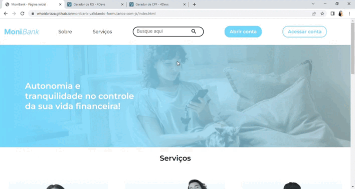

  

  

Formulário de criação de contas para o banco virtual MoniBank.

# Programa Desenvolve 2023 - JavaScript: validando formulários

Repositório criado com o objetivo de registrar meu progresso no Programa Desenvolve 2023 do Grupo Boticário em parceria com a Alura praticando o que foi abordado nas aulas do curso:  
JavaScript: validando formulários, implementando validações nos campos do formulário de cadastro do Monibank, e, como bônus, implementamos a página de reconhecimento facial do nosso formulário.  
Nela a pessoa usuária será capaz de capturar uma imagem sua com a câmera — ou seja, aprendemos a tirar fotografias com Javascript!

## Demonstração:

[MoniBank](https://whoisbrizza.github.io/monibank-validando-formularios-com-js/)

  

## Tecnologias utilizadas durante o curso
* JavaScript

## Tecnologias utilizadas no projeto
* HTML
* CSS

## Tópicos abordados no curso:

* Validando com HTML  
* Validando com JS  
* Desenvolvendo validações  
* Comunicando ao usuário  
* Capturando fotos
